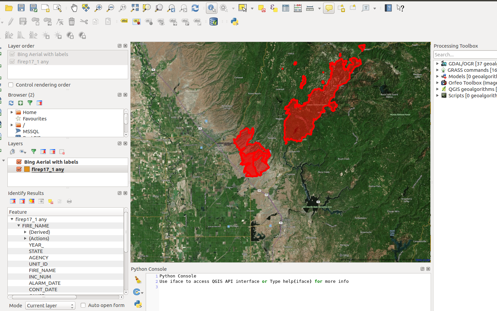

# Epimetheus

imagenet for finding burned buildings post-fire
https://arxiv.org/abs/1803.00397

Google maps has fire perimeter data :
https://www.google.com/maps/d/viewer?ll=37.750541788857575%2C-118.88610336737747&hl=en&z=13&mid=1ZpcZ8OMZh1G1XwRmt9GaCwH6f-g

## Kaggle
- Nice analysis of a dataset of 1.8 million wildfires https://www.kaggle.com/captcalculator/wildfire-exploratory-analysis/notebook (To use this we would need to carefully coordinate wildfire date and satellite aquisition times)

## CalFire datasets
- http://frap.fire.ca.gov/data/frapgisdata-subset

- GIS data from CalFire, loadable from QGIS : http://frap.fire.ca.gov/data/frapgisdata-sw-fireperimeters_download

